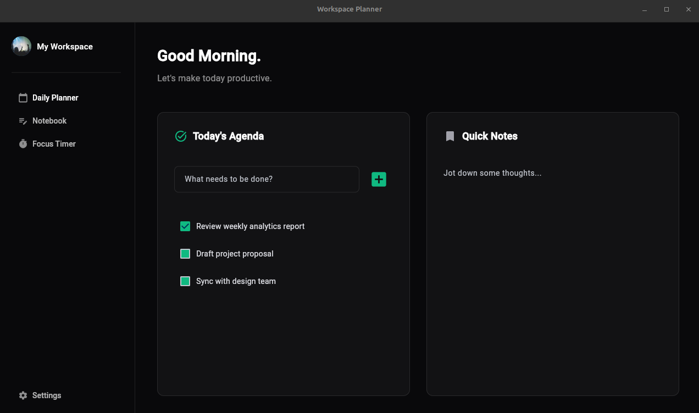

# 🎨 Flet Workspace Planner, Educational GUI Template

A modern, dark-themed desktop & web dashboard template built using [Flet](https://flet.dev) (Python + Flutter) and managed with [uv](https://docs.astral.sh/uv/).



This repository serves as an **educational starter kit** for developers exploring Python GUI development with Flet. It demonstrates clean UI layout practices, component structure, state management, and micro-interactions without relying on heavy external state frameworks.

---

## ✨ Features & Visual Highlights

* **🎨 Modern Dark Theme:** Styled with custom zinc and emerald accent palettes (`#09090B`, `#10B981`).
* **📌 Persistent Navigation Sidebar:** Clean side menu featuring profile display, structured action links, and auto-flex layout (`expand=True`).
* **✅ Interactive Daily Planner:** Add tasks dynamically to a reactive checklist with real-time UI state refreshes (`page.update()`).
* **📝 Quick Notes Card:** Clean, borderless multiline text editing field.
* **⚡ Modern Tooling with `uv`:** Fully reproducible environment using `pyproject.toml` and `uv.lock`.
* **📖 Fully Documented:** Line-by-line inline annotations and reference docstrings for educational reading.

---

## 🛠️ Tech Stack & Prerequisites

* **Package & Project Manager:** [uv](https://docs.astral.sh/uv/)
* **Language:** Python 3.8+ (managed seamlessly via `uv`)
* **GUI Engine:** [Flet](https://flet.dev) (powered by Flutter)

> **Note:** If you don't have `uv` installed, you can install it via:
> ```bash
> # macOS / Linux
> curl -LsSf [https://astral.sh/uv/install.sh](https://astral.sh/uv/install.sh) | sh
> 
> # Windows (PowerShell)
> powershell -ExecutionPolicy ByPass -c "irm [https://astral.sh/uv/install.ps1](https://astral.sh/uv/install.ps1) | iex"
> ```

---

## 🚀 Quick Start

### 1. Clone the Repository
```bash
git clone https://github.com/henderson-01/flet-workspace-planner.git
cd flet-workspace-planner
```

### 2. Install & Sync Dependencies
With `uv`, you don't need to manually create or manage virtual environments. Running `uv sync` automatically creates a virtual environment and installs exact dependency versions pinned in `uv.lock`:

```bash
uv sync
```

### 3. Run the Application

Execute the application directly within the `uv` environment:

```bash
# Run via standard Python runner
uv run main.py
```

Or run using the Flet CLI (enables Hot Reload during development):
```bash
uv run flet run main.py
```

---

## 📦 Adding or Updating Dependencies

If you want to add new packages to this template while developing:

```bash
# Add a new package (updates pyproject.toml and uv.lock)
uv add package-name

# Add a dev-only dependency
uv add --dev pytest
```

---

## 📚 Key Educational Concepts Covered

If you are new to Flet, this codebase highlights several fundamental concepts:

### 1. UI Tree & Layout Structure
Flet builds UIs using nested controls:
* `ft.Row`: Lays out controls horizontally.
* `ft.Column`: Lays out controls vertically.
* `ft.Container`: Wraps elements to supply padding, background color, borders, and interaction handlers.

### 2. State & Dynamic Controls
Adding items to a list on the fly requires updating control collections and calling `page.update()`:
```python
def add_task(_):
    if new_task_input.value:
        task_list.controls.append(
            ft.Checkbox(label=new_task_input.value, fill_color="#10B981")
        )
        new_task_input.value = ""
        page.update() # Refreshes canvas to show the updated checklist
```

### 3. Micro-Animations & Hover Events
Hover effects are achieved by listening to the `on_hover` event on a `Container` and tweaking its `scale` property:
```python
def hover_lift(e):
    # e.data evaluates to "true" on mouse enter and "false" on mouse leave
    e.control.scale = 1.01 if e.data == "true" else 1.00
    e.control.update()
```

---

## 🤝 Contributing

Contributions, issues, and feature requests are always welcome! This project is intended to grow as a community-driven learning resource.

### How You Can Help:
* 🐛 **Report Bugs:** Notice a visual glitch or issue on a specific OS? Open an issue!
* 💡 **Add Features:** Want to implement persistent storage, tab switching, or new Flet controls?
* 📖 **Improve Docs:** Clearer explanations, better docstrings, or fixing typos are huge help.
* 🎨 **UI/UX Polish:** Enhancements to animations, themes, or responsive layouts.

### Steps to Contribute:
1. Fork the project.
2. Create your feature branch (`git checkout -b feature/AmazingFeature`).
3. Sync your environment with `uv sync`.
4. Run and Test the GUI (`uv run main.py`)
5. Commit your changes (`git commit -m 'Add some AmazingFeature'`).
6. Push to the branch (`git push origin feature/AmazingFeature`).
7. Open a **Pull Request**.

---

## 💡 Ideas for Extending This Template

Want to practice extending this app yourself? Here are some simple exercises:

1. **Persist Tasks:** Connect SQLite or JSON storage so tasks remain saved after closing the app.
2. **Interactive Sidebar:** Turn the sidebar buttons into functional tab switchers using Flet views.
3. **Focus Timer:** Build out the "Focus Timer" menu button to render an active Pomodoro countdown clock.
4. **Theme Switcher:** Add a toggle in the sidebar to switch between Light Mode and Dark Mode dynamically.

---

## 📜 License

This project is open-source and available under the [MIT License](LICENSE). Feel free to use, modify, and distribute it for personal or educational projects!
